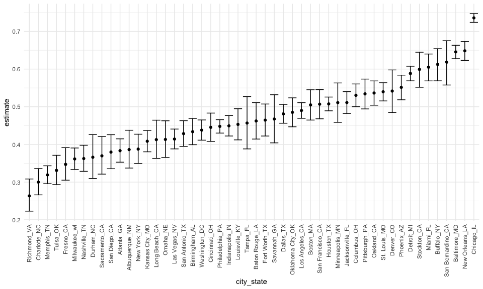
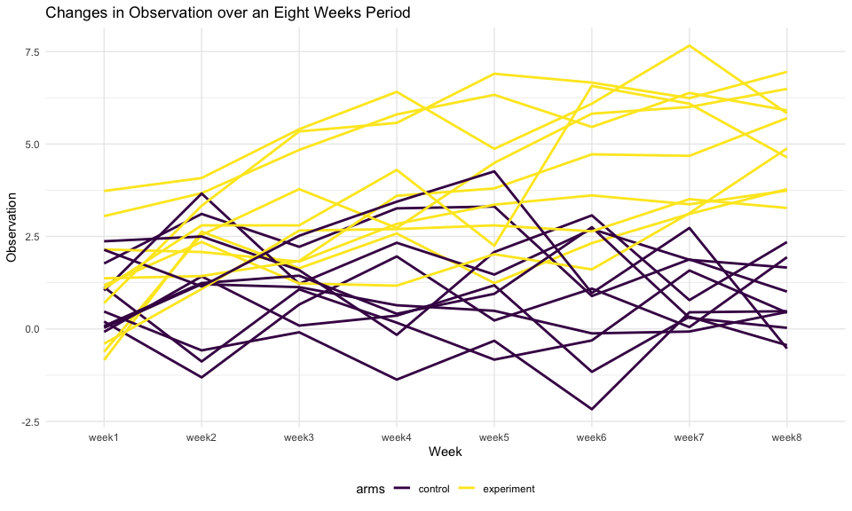
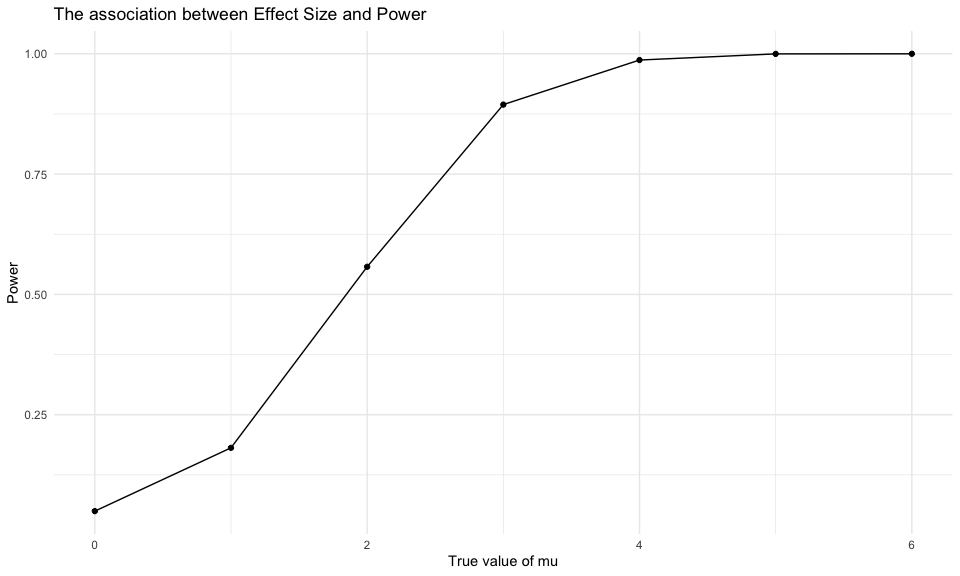

P8105 Homework 5
================
Jiayi Zhou

## Problem 1:

**Description on the raw dataset:** This dataset contains homicides data
in 50 cities in the U.S. There were 12 variable describing the
characteristics of each victim in the raw data, including their name,
age, sex, and the disposition status. There were 52179 entries in total.

**Import and organize data**

``` r
homicide_df = 
  read_csv("./data/homicide-data.csv") %>% 
  mutate(
    city_state = str_c(city, state, sep = "_"),
    resolved = case_when(
      disposition == "Closed without arrest" ~ "unsolved",
      disposition == "Open/No arrest"        ~ "unsolved",
      disposition == "Closed by arrest"      ~ "solved",
    )
  ) %>% 
  select(city_state, resolved) %>% 
  filter(city_state != "Tulsa_AL")
```

``` r
aggregate_df = 
  homicide_df %>% 
  group_by(city_state) %>% 
  summarize(
    hom_total = n(),
    hom_unsolved = sum(resolved == "unsolved")
  )
```

**prop.test:** using `prop.test` to get the proportion of unsolved
homicides in Baltimore:

``` r
prop.test(
  aggregate_df %>% filter(city_state == "Baltimore_MD") %>% pull(hom_unsolved), 
  aggregate_df %>% filter(city_state == "Baltimore_MD") %>% pull(hom_total)) %>% 
  broom::tidy()
```

    ## # A tibble: 1 x 8
    ##   estimate statistic  p.value parameter conf.low conf.high method    alternative
    ##      <dbl>     <dbl>    <dbl>     <int>    <dbl>     <dbl> <chr>     <chr>      
    ## 1    0.646      239. 6.46e-54         1    0.628     0.663 1-sample… two.sided

run `prop.test` for each of the cities in the dataset:

``` r
results_df = 
  aggregate_df %>% 
  mutate(
    prop_tests = map2(.x = hom_unsolved, .y = hom_total, ~prop.test(x = .x, n = .y)),
    tidy_tests = map(.x = prop_tests, ~broom::tidy(.x))
  ) %>% 
  select(-prop_tests) %>% 
  unnest(tidy_tests) %>% 
  select(city_state, estimate, conf.low, conf.high)
```

**plot with error bars:**

``` r
results_df %>% 
  mutate(city_state = fct_reorder(city_state, estimate)) %>% 
  ggplot(aes(x = city_state, y = estimate)) +
  geom_point() + 
  geom_errorbar(aes(ymin = conf.low, ymax = conf.high)) + 
  theme(axis.text.x = element_text(angle = 90, vjust = 0.5, hjust = 1))
```



## Problem 2:

#### Tidy dataframe:

Create a tidy dataframe containing data from all participants, including
the subject ID, arm, and observations over time

``` r
files= list.files("./data2")

read_listfiles = function(x) {
  path = str_c("./data2/",x)
  
  read_csv(path) %>% 
  janitor::clean_names()
}

tidy_df = 
  map_df(files, read_listfiles) %>% 
  mutate(files_names = files) %>% 
  relocate(files_names) %>% 
  separate(files_names, into = c("arms", "subject_id"), sep = c("_")) %>% 
  mutate(
    subject_id = str_remove(subject_id, ".csv"),
    subject_id = as.factor(subject_id),
    arms = recode_factor(arms,"con" = "control", "exp" = "experiment")) %>% 
  pivot_longer(
    week_1:week_8,
    names_to = "weeks",
    values_to = "observations"
  ) %>% 
  mutate(
    weeks = str_remove(weeks, "_"),
    weeks = as.factor(weeks))
```

#### Spaghetti plot

Make a spaghetti plot showing observations on each subject over time,
and comment on differences between groups.

``` r
##tidy_df %>% 
##  interaction("arms", "subject_id")
```

``` r
tidy_df %>%
  group_by(arms, subject_id) %>% 
  ggplot(aes(x = weeks, y = observations, group = interaction(arms, subject_id), color = arms)) +
  geom_line(size = 1) +
  labs(x = 'Week',
       y = 'Observation',
       title = 'Changes in Observation over an Eight Weeks Period')
```



**Comment:** Observations in control group and experiment group started
of at a similar value.However the observations in experiment group had
an prominent increasing trend, which soon surpassed the observation
values of control group over the eight weeks period. On the other hand,
observation values in control group did not obvious changing trend.

## Problem 3:

simulation to explore power in a simple linear regression

#### Function setup:

``` r
sim_ttest = function(mu){
  
  sim_data = tibble(
    x = rnorm(n = 30, mean = mu, sd = 5)
  )
  
  sim_data %>% 
    t.test(mu = 0, alternative = "two.sided", conf.level = 0.95) %>% 
    broom::tidy() %>% 
    select(estimate, p.value)
}

sim_ttest(0)
```

    ## # A tibble: 1 x 2
    ##   estimate p.value
    ##      <dbl>   <dbl>
    ## 1    0.412   0.629

**5000 times simulation for mu = 0:**

``` r
sim_result0 = 
  rerun(5000, sim_ttest(0)) %>% 
  bind_rows()
```

**5000 times simulation for mu = c(1,2,3,4,5,6):**

``` r
sim_results = 
  tibble(mu = c(1, 2, 3, 4, 5, 6)) %>% 
  mutate(
    output_lists = map(.x = mu, ~rerun(5000, sim_ttest(.x))),
    estimate_dfs = map(output_lists, bind_rows)) %>% 
  select(-output_lists) %>% 
  unnest(estimate_dfs)
```

#### Plots

**Plot1:** Make a plot showing the proportion of times the null was
rejected (the power of the test) on the y axis and the true value of μ
on the x axis. Describe the association between effect size and power.

``` r
power = 
  sim_results %>% 
  mutate(decision = case_when(
    p.value < 0.05 ~ "rejected",
    p.value >= 0.05 ~ "fail to reject"
    ))%>% 
  group_by(mu) %>% 
  summarize(
    total_decision = n(),
    total_reject = sum(decision == "rejected")
  ) %>% 
  mutate(
    prop_tests = map2(.x = total_reject, .y = total_decision, ~prop.test(x = .x, n = .y)),
    tidy_tests = map(.x = prop_tests, ~broom::tidy(.x))
  ) %>% 
  select(-prop_tests) %>% 
  unnest(tidy_tests) %>% 
  select(mu, estimate, conf.low, conf.high) %>%
  rename(power = estimate)

power %>% 
  ggplot(aes(x = mu, y = power )) +
  geom_point() +
  geom_smooth() + 
  labs(
    x = "Effect Size (mu)",
    y = "Power",
    title = "The association between Effect Size and Power"
  )
```



**Comment:** Power is positively related to effect size. Under the null
hypothesis of mu = 0, as the effect size (mu) increased from 1 to 6, the
power also increased and reached the highest value 1 when effect size is
4.
